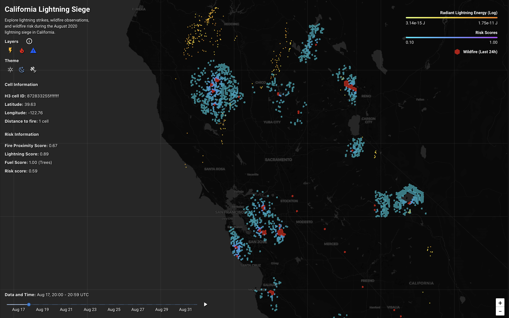

# Lightning Strikes and Wildfire during the 2020 California Lightning Siege

This is an interactive app which allows you to explore lightning strikes, resulting wildfires, and fire risk during the 2020 lightning siege in California. 



## Calculating Risk

The app includes a _risk_ layer, which we compute as a **Multi-Criteria Evaluation** based on aggregated spatially and temporarily close lightning, land-cover fuel scores, and the distance to the nearest fire within 24 hours. Specifically, we employ the below formula:

$$
R(c, t) = \min\left(
    1, \frac{
        \log_{10} (1 + E_{4,72}(c,t) \times 10^{14.5})
    }{
        L_\text{max}
    }
    \right)
    \times F(c) \times \frac{1}{D_{24}(c,t) + 1}
$$

where:

- $R(c,t)$ is the risk score for a H3 hexagonal cell $c$ at time $t$.

- $E_{4,72}$ is the sum of lightning energy in all neighbor cells at distance $k \le 4$ and between times $t$ and $t-72$.

- $L_\text{max}$ is the 99th percentile of all $\log_{10} (1 + E_{4,72}(c,t) \times 10^{14.5})$ terms in the data.

- $F(c)$ is the fuel score of cell $c$, derived from it's land-cover.

- $D_{24}(c,t)$ is the distance (in terms of cells) between cell $c$ and the nearest cell with an observed fire between times $t$ and $t-24$.

## Getting Started

_Note: This project was developed and tested on macOS (Apple Silicon, osx-arm64). Compatibility with Linux or Windows is not guarenteed._

### 1. Prerequisites

Install [Pixi](https://pixi.prefix.dev/latest/) by running:

**macOS / Linux:**
```bash
curl -fsSL https://pixi.sh/install.sh | bash
```

**Windows:**
```PowerShell
iwr -useb https://pixi.sh/install.ps1 | iex
```

_Note: You might have to restart your terminal after installation for the pixi command to become available._

### 2. Clone the Repository

Clone the repository and navigate to the project directory:

```bash
git clone https://github.com/sanderengel/gds_exam_project

cd gds_exam_project
```

### 3. Environment Setup

This project uses [Pixi](https://pixi.prefix.dev/latest/) for environment management and dependency tracking. The environment is defined via the `pixi.toml` and `pixi.lock` files. 

To create the environment and install all necessary dependencies (including Python, spatial libraries, and command-line tools like `curl`), run:

```bash
pixi install
```

## App

Use the app by running:

```bash
pixi run app
```

_Note: While I have tried to optimize the app as much as possible (I am no expert), expect it to take at least 30 seconds to load..._

## Raw Data

We collect the raw lightning and fire data through NASA Earthdata and NASA FIRMS, respectively. 

The raw fire data can be found at `data/fire/DL_FIRE_SV-C2_745271/fire_archive_SV-C2_745271.csv`.

Due to the large size of the raw lightning data, we cannot upload it here to this repo. Instead, here is a (barely) short guide of how to fetch the data.

### Fetch NASA Earthdata GLMCIERRA Lightning Strikes

1. **Account & Authorization:** Create a free account at [NASA Earthdata](https://urs.earthdata.nasa.gov/profile). You will likely be asked to authorize, which you must do. 

2. **Run Download Script:** Navigate to the root directory of this repository and run the command below. Please note that the dataset consists of approximately 1,800 files. The total size is around 8GB, and the download will likely take several minutes depending on your connection.

   ```bash
   pixi run download-lightning
   ```

3. **Authentication:** Once the script starts, it will ask you for the Earthdata username and password. The script handles the transfer and temporarily stores your credentials in a secure `.netrc` file to authenticate each granule. 

4. **Store:** The files will be automatically saved to `data/lightning/glmcierra/`. Ensure you have enough disk space before begining the process.

## Processed Lightning and Fire Data

Due to the nature of NASA satellite granules, the raw lightning data contains many lightning strike observations outside the California boundary. We remove these and clean and enhance the data (e.g. by adding `h3` hexagonal tessellation IDs) in `process_data/process_lightning.py`. The raw fire data is better contained, but we nonetheless clean it, enhance it, and aggregate to polygons in `process_data/process_fire.py`. For both, the processed data is stored in `.feather` files and available directly in the repo at:

- `data/lightning/california_lightning_siege_2020.feather`
- `data/fire/california_fire_polygons.feather`

If you went through the trouble of downloading the raw data as described above, you might want to re-process it yourself. To process the raw data and generate the two `.feather` files mentioned above, run the following command:

```bash
pixi run process-data
```

The above command will process both raw lightning and fire data. To process only one of the two, run the corresponding command:

```bash
python process_data/process_lightning.py

python process_data/process_fire.py
```

## Re-Compute the Risk Grid

To compute the risk layer, we first compute risk scores for every combination of h3 cells and 1-hour bins and store it in `data/risk/risk_grid.feather`. These risk scores are based on a range of features computed from the lightning and fire data, as well as sampling from the [Esri 10-Meter Land Use/Land Cover dataset](https://planetarycomputer.microsoft.com/dataset/io-lulc-9-class) (collection: `io-lulc-9-class`). Running the below command will do all of that to generate the risk scores grid:

```bash
pixi run build-risk
```

## Data Souces

- **Lightning:** Goodman, S. J., et al. (2013). The GOES-R Geostationary Lightning Mapper (GLM). *Atmospheric Research*, 125–126, 34–49. Data accessed via [NASA Earthdata](https://earthdata.nasa.gov/) (GOES-17 GLM CIERRA, 2020).

- **Fire:** NASA FIRMS. (2020). *SUOMI VIIRS C2 Active Fire Product* [Dataset]. NASA Fire Information for Resource Management System. Area: [-124.5, 32.5, -114.1, 42.0], 2020-08-13 – 2020-08-31. Retrieved from [https://earthdata.nasa.gov/firms](https://earthdata.nasa.gov/firms)

- **Land Cover:** Impact Observatory & Esri. (2022). *10m Annual Land Use Land Cover (9-class) V1* [Dataset]. Produced by Impact Observatory; licensed by Esri; hosted by Microsoft Planetary Computer. License: CC BY 4.0. Retrieved from [https://planetarycomputer.microsoft.com/dataset/io-lulc-9-class](https://planetarycomputer.microsoft.com/dataset/io-lulc-9-class)

## License

This project is licensed under the [MIT License](LICENSE).

## Authors

Sander Engel Thilo

_<saet@itu.dk>_

**IT University of Copenhagen**